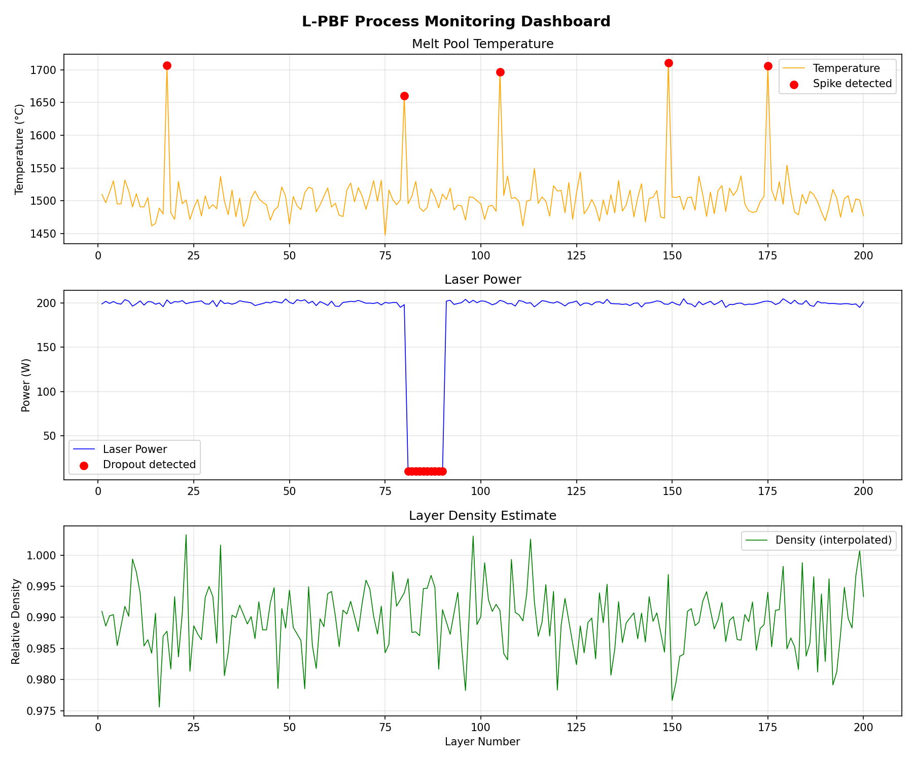

# L-PBF Process Monitoring

A Python pipeline for simulating and monitoring sensor data from a **Laser Powder Bed Fusion (L-PBF)** additive manufacturing process. The system generates synthetic layer-by-layer process signals, runs anomaly detection, and produces a visual monitoring dashboard.

---

## What is L-PBF?

Laser Powder Bed Fusion is a metal 3D printing process where a laser selectively melts layers of metal powder to build up a part. Key process parameters — melt pool temperature, laser power, and layer density — must stay within tight tolerances, making real-time monitoring critical for part quality.

---

## Pipeline Overview

```
data_generator.py  →  lpbf_data.csv
        ↓
   pipeline.py     →  lpbf_data_clean.csv
        ↓
  visualize.py     →  lpbf_monitoring_dashboard.png
```

---

## Scripts

### `data_generator.py`
Simulates 200 layers of L-PBF process data and saves it to `lpbf_data.csv`.

| Signal | Simulation |
|---|---|
| Melt pool temperature | Normal distribution (mean 1500°C, σ=20) with 5 random spike injections (+200°C) |
| Laser power | Normal distribution (mean 200W, σ=2) with a power dropout between layers 80–90 |
| Layer density | Exponential stabilization curve with Gaussian noise and 10 random NaN gaps |

### `pipeline.py`
Loads the raw CSV, runs quality checks, detects anomalies, and saves a cleaned dataset to `lpbf_data_clean.csv`.

- **Temperature spike detection** — 3-sigma rule: flags any reading above `mean + 3σ`
- **Laser power dropout detection** — flags any reading below `mean − 3σ`
- **Density gap interpolation** — fills NaN values using linear interpolation

### `visualize.py`
Loads the cleaned dataset and generates a 3-panel monitoring dashboard saved as `lpbf_monitoring_dashboard.png`.

- Panel 1: Melt pool temperature with spike markers (red dots)
- Panel 2: Laser power with dropout markers (red dots)
- Panel 3: Layer density estimate (interpolated)

---

## Dashboard



---

## Setup & Usage

**Requirements**
```
numpy
pandas
matplotlib
```

Install dependencies:
```bash
pip install numpy pandas matplotlib
```

Run the full pipeline in order:
```bash
python data_generator.py
python pipeline.py
python visualize.py
```

---

## Output Files

| File | Description |
|---|---|
| `lpbf_data.csv` | Raw simulated sensor data (200 layers) |
| `lpbf_data_clean.csv` | Cleaned data with anomaly flag columns added |
| `lpbf_monitoring_dashboard.png` | 3-panel process monitoring chart |

---

## Credits

**Author** — Bhuvan Puttaswamy

**AI Assistance** — Pipeline design, anomaly detection logic, and documentation were developed with the help of [Claude](https://claude.ai) by [Anthropic](https://www.anthropic.com).

**Libraries**
- [NumPy](https://numpy.org) — Numerical data simulation and statistical thresholding
- [pandas](https://pandas.pydata.org) — Data loading, cleaning, and interpolation
- [Matplotlib](https://matplotlib.org) — Process monitoring dashboard visualization

**Concept Reference** — L-PBF process monitoring is an active area of research in metal additive manufacturing. The 3-sigma anomaly detection approach is a standard statistical process control (SPC) technique widely used in manufacturing quality assurance.
